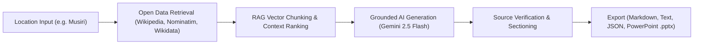

# ZENITHIAN – AI CONTENT TRANSFORMATION PLATFORM

Zenithian is a professional AI-powered web application that retrieves location-based records from authorized public open data sources (Wikipedia API, OpenStreetMap Nominatim, Wikidata) and transforms them into structured communication outputs (Summaries, Reports, Emails, Public Announcements, and editable PowerPoint presentations).

---

## PROJECT GOAL & WORKFLOW



**Zero Document Upload**: Users specify a village, town, or city location. Data is retrieved automatically from live authorized data APIs.

---

## TECH STACK

- **Frontend**: React 18, Vite, Tailwind CSS, React Router v6, Lucide React icons.
- **Backend**: Python 3.13, FastAPI, `python-pptx`, `httpx`, `pydantic`.
- **Database & Auth**: Supabase PostgreSQL & Supabase Auth.
- **AI Model**: Google Gemini 2.5 Flash / OpenAI GPT-4o-mini (Grounded Prompts).

---

## GETTING STARTED

### Prerequisites

- Node.js (v18+) & npm
- Python (v3.10+)

### 1. Backend Setup

Open PowerShell or Terminal:

```powershell
cd backend

# Create Python virtual environment
python -m venv venv

# Activate virtual environment (Windows PowerShell)
.\venv\Scripts\activate

# Install dependencies
pip install -r requirements.txt

# Create environment configuration file
copy .env.example .env
```

Edit `backend/.env` to configure your API keys:

```env
GEMINI_API_KEY=your_google_gemini_api_key
TWITTER_API_KEY=your_twitterapi_io_key
SUPABASE_URL=https://your-project.supabase.co
SUPABASE_KEY=your_supabase_anon_key
```

When recent events are enabled, Zenithian queries Twitterapi.io for the latest posts matching the requested location and timeframe, filters out posts that do not mention that location, and falls back to Google News RSS when Twitterapi.io is unavailable.

Run the FastAPI backend server:

```powershell
uvicorn main:app --reload --port 8000
```

The API will be available at `http://127.0.0.1:8000`.

---

### 2. Frontend Setup

Open a second terminal window:

```powershell
cd frontend

# Install Node dependencies
npm install

# Start Vite dev server
npm run dev
```

The React dashboard will launch at `http://localhost:5173`.

---

## DATABASE SETUP (SUPABASE)

1. Log in to your [Supabase Dashboard](https://supabase.com).
2. Create a new project.
3. Open the **SQL Editor**.
4. Copy and execute the contents of `supabase/schema.sql`.
5. Copy your project URL and Anon Key into `backend/.env` and `frontend/.env`.

---

## API ENDPOINTS

- `GET /api/health` - System status & API keys diagnostic check.
- `GET /api/status` - Detailed service diagnostics.
- `POST /api/location/retrieve` - Retrieves live data for location & categories from Wikipedia REST API and Nominatim.
- `POST /api/rag/process` - Chunks text and ranks context relevance.
- `POST /api/content/generate` - Generates grounded content outputs using Gemini 2.5 Flash.
- `POST /api/export/pptx` - Generates downloadable 9-slide PowerPoint `.pptx` presentation.
- `GET /api/history` - Returns output history.
- `POST /api/history` - Saves generated output.

---

## NO-DEMO & ERROR HANDLING POLICIES

- **No Demo Labels**: The application operates as a production tool.
- **Explicit Unavailable Notices**: If public records for a category are absent, Zenithian displays a notice rather than inventing facts.
- **Configuration Alerts**: If `GEMINI_API_KEY` is missing in `backend/.env`, clear configuration notices are displayed.
